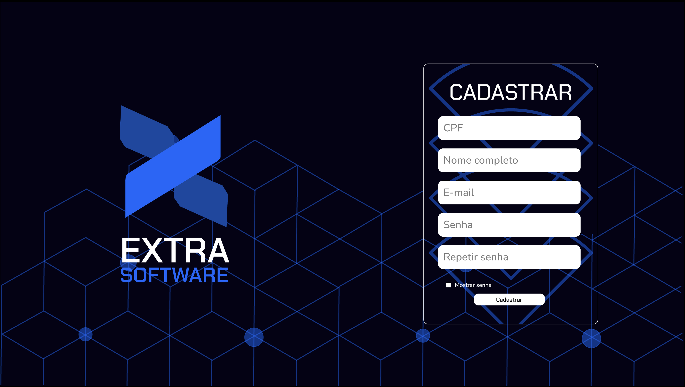

### Protótipo de Alta
O protótipo de alta é uma representação visual do sistema que permite aos usuários e desenvolvedores visualizar como será a interface e a interação com o software. Este protótipo é uma etapa crucial no processo de desenvolvimento, pois ajuda a identificar problemas de usabilidade e funcionalidade antes da implementação final.

#### Protótipo de Alta no Figma
O protótipo de alta fidelidade foi desenvolvido utilizando o Figma, uma ferramenta de design colaborativo que permite a criação de interfaces interativas. O protótipo inclui todos os elementos visuais necessários para simular a experiência do usuário, incluindo botões, menus, formulários e outros componentes da interface.

<iframe style="border: 1px solid rgba(0, 0, 0, 0.1);" width="800" height="450" src="https://embed.figma.com/design/7ggDawSwYQMBsDpxPkl2GM/Alta-fidelidade?node-id=0-1&embed-host=share" allowfullscreen></iframe>

### User stories no protótipo
#### US01:

#### US02:

#### US06:

#### US07:

