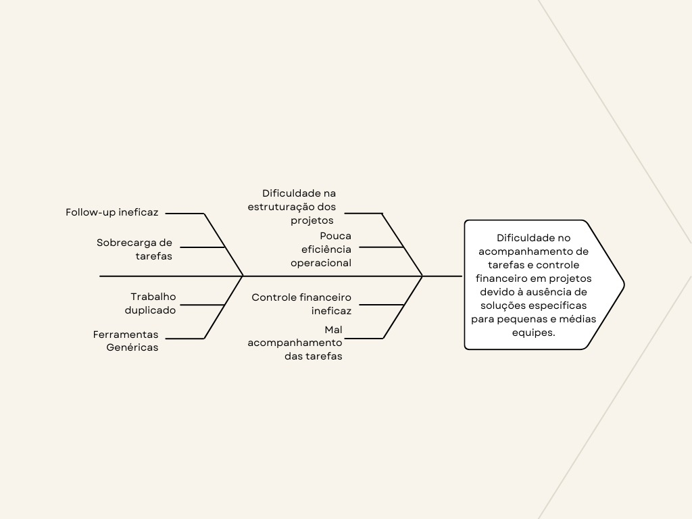

# CENÁRIO ATUAL DO CLIENTE E DO NEGÓCIO
## Introdução ao Negócio e Contexto
A pequena empresa Extra Software é uma iniciante no ramo de TI. Atualmente desenvolve sistemas de gestão empresarial voltados para a otimização de processos internos e melhoria da eficiência operacional. Mesmo dando os seus primeiros passos no mercado, a Extra Software busca constantemente entregar soluções tecnológicas personalizadas de alta qualidade.

## Identificação da Oportunidade ou Problema
Durante a análise do cenário atual de pequenas e médias equipes, a Extra Software identificou uma lacuna recorrente: a dificuldade em acompanhar com clareza as tarefas em andamento. Muitas dessas equipes recorrem a planilhas ou ferramentas genéricas, o que resulta em registros dispersos, retrabalho e falhas de comunicação interna. A ausência de uma solução dedicada compromete a visibilidade das demandas e impede o acompanhamento eficaz do progresso dos projetos.
Esse cenário cria obstáculos para a produtividade, já que os gestores têm dificuldade em entender o status real das atividades e alocar recursos de forma eficiente. Além disso, os membros da equipe enfrentam incertezas quanto às suas responsabilidades e prazos, o que acentua os atrasos e desorganiza o fluxo de trabalho.
Diante disso, a oportunidade surge em oferecer uma solução que centralize o acompanhamento das tarefas, proporcione maior transparência na execução das atividades e fortaleça a gestão dos projetos. Ao atuar diretamente sobre esse problema, o sistema proposto pela Extra Software visa transformar a forma como essas equipes organizam e monitoram seu trabalho, promovendo maior controle, previsibilidade e eficiência operacional.

## Desafios do Projeto 
Entre os principais desafios enfrentados pelo projeto, destacam-se:
Desafio técnico: A construção de um sistema robusto e escalável que consiga integrar funcionalidades de gestão de tarefas com módulos de controle financeiro, mantendo a performance e a usabilidade.
Desafio de conhecimento: Por se tratar de uma empresa iniciante, a Extra Software ainda está construindo sua base de conhecimento e experiência no desenvolvimento de soluções completas e integradas, o que exige uma curva de aprendizado constante da equipe.
Desafio operacional: Com recursos limitados, tanto financeiros quanto humanos, a empresa precisa gerenciar o desenvolvimento do projeto de forma eficiente, priorizando entregas de valor e evitando desperdícios.

## Segmentação de Clientes
Os usuários finais da solução da Extra Software são profissionais que atuam diretamente no gerenciamento e execução de projetos, com perfil técnico e conhecimento em tecnologia da informação.
Os principais perfis de usuários incluem:  
### Gestores de projetos
<ul>
<li>Responsáveis por acompanhar o andamento de múltiplas demandas, organizar tarefas e supervisionar a execução de atividades. Costumam ter experiência em ferramentas digitais e utilizam os dados do sistema para tomar decisões estratégicas e garantir a eficiência da equipe.</li>
</ul>

### Funcionários técnicos
<ul>
<li>
Profissionais que atuam diretamente nos projetos e utilizam o sistema para registrar, atualizar e acompanhar tarefas, prazos e informações financeiras relacionadas à sua atuação. Possuem conhecimento técnico intermediário ou avançado, o que facilita a adoção de sistemas de gestão mais completos.
</li>
</ul>
Esses usuários, em geral, têm entre 25 e 45 anos e estão acostumados com ferramentas digitais no ambiente de trabalho. Valorizam soluções que integrem diferentes aspectos do projeto — como tarefas, prazos e finanças — de forma clara, organizada e eficiente.

